# 🛡️ PocketSOC

> **A Production-Grade, End-to-End AI Fraud & Threat Detection Platform.**


## 🎯 Overview
PocketSOC is a complete cybersecurity demonstrator that detects SMS fraud on mobile devices using local AI and reports threats to a secure cloud dashboard. It showcases a full pipeline: **On-Device Inference** → **Secure Transport (AES-256)** → **Real-time Visualization**.

---

## ⚡ Key Features

*   **📱 Mobile AI Agent**: Runs a lightweight TFLite model to detect scams *offline* with low latency.
*   **🔒 Zero-Trust Security**: IPayloads are encrypted with **AES-256-GCM** before leaving the device.
*   **🌐 Real-Time Dashboard**: A stunning React UI to visualize the threat stream and system health.
*   **🛡️ Secure Backend**: FastAPI server with **JWT Authentication** and **RBAC**.
*   **🔗 Immutable Audit Log**: Hash-chained database logs to prevent tampering.


---

## 🏗️ Architecture

```mermaid
graph LR
    A[📱 Mobile Agent] -->|TFLite Inference| B(Scam Detected?)
    B -->|Yes| C[🔒 AES-256 Encryption]
    C -->|HTTPS POST| D[☁️ Secure Backend]
    D -->|Decrypt & Verify| E[💾 Audit Store]
    D -->|Real-time Socket| F[🖥️ Live Dashboard]
```



---

## 🚀 Quick Start

### 1. Prerequisites
*   Python 3.9+
*   Node.js & npm

### 2. Backend Setup
```bash
# Install Python dependencies
pip install -r requirements.txt

# Start the Backend Server
uvicorn backend.main:app --host 0.0.0.0 --port 8000 --reload
```

### 3. Frontend Setup
```bash
# Open a new terminal
cd frontend

# Install Node modules
npm install

# Start the Dashboard
npm run dev
```
> Access the dashboard at **http://localhost:5174** (or port shown in terminal).

### 4. Run Simulation
1.  Open the **Dashboard** in your browser.
2.  Scroll to the **Threat Simulator**.
3.  Type a message like: *"URGENT: Click here to verify your bank account"*
4.  Click **Send** and watch the alert pop up instantly!

---

## 📂 Project Structure
*   `agent/`: Python script simulating the mobile defense app.
*   `backend/`: FastAPI server handling encryption, auth, and logic.
*   `frontend/`: React + Tailwind + Vite visualization dashboard.
*   `model/`: Scripts to train and convert the AI model (TensorFlow).
*   `benchmarks/`: Tools to test latency and throughput.

---

## 🔧 Tech Stack
*   **Core**: Python, React, JavaScript
*   **AI**: TensorFlow, TFLite, Scikit-learn
*   **Web**: FastAPI, Vite, Tailwind CSS
*   **Security**: PyCryptodome (AES-GCM), JOSE (JWT)

---
*Built for the Advanced AI Coding Showcase.*
